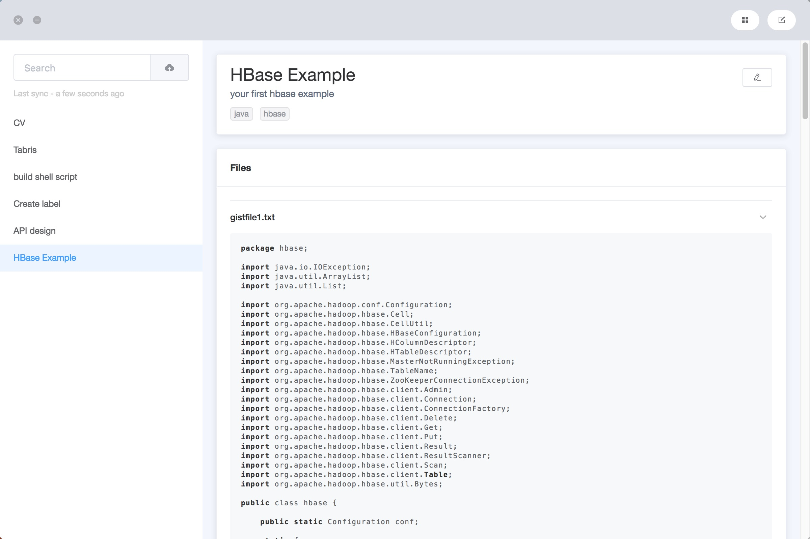

# Jist

> A Code Snippets Manager for Github Gist.



#### Feature

- Local storage
- Quick search
- More meta information
- Code highlighting
- Sync with Github Gist

#### Build Setup

``` bash
# install dependencies
yarn install

# run development
yarn dev

# build electron application for production
yarn build

```

---

This project was generated with [electron-vue](https://github.com/SimulatedGREG/electron-vue) using [vue-cli](https://github.com/vuejs/vue-cli). Documentation about the original structure can be found [here](https://simulatedgreg.gitbooks.io/electron-vue/content/index.html).
